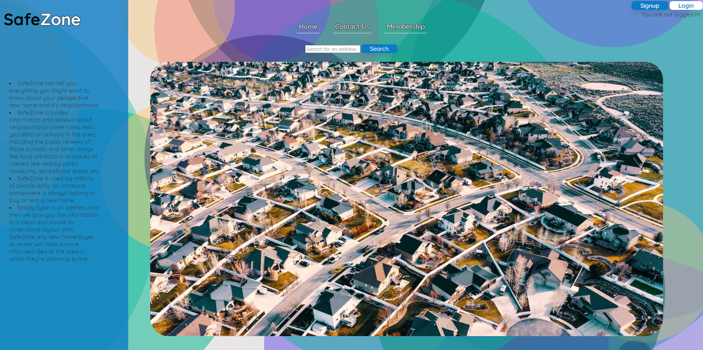

# Community Compass

## Description

* User Story - As a prospective home buyer or renter, I want to be able to use a single app to tell me everything I might want to know about my new home’s neighborhood.

* Project Description - A Neighborhood Information App
- We will provide information and reviews about neighborhood crime rates from crimegrade.org, include data on schools from greatschools.org/api/, property values from realtor/zillow API, and other things like local attractions or places of interest like parks, museums, recreational areas, etc all within a 10 mile (for example) radius of the address and the user reviews of those places would come from yelp.com/developers.
- It would be practical for millions of people daily as someone somewhere is always looking to buy or rent a new home.
- The user would simply type in an address and then we convert that address into lat/long and run those numbers against the aforementioned APIs, and return that information in a clean and simple to understand layout.
- This app would allow home buyers or renters to have a more informed idea of the area in which they're planning to move.
- We are considering having a free membership which would return the neighborhood crime grade, and perhaps the school zone and school reviews, while offering a “premium” membership that would return all the additional information listed above. 

## Table of Contents

- [Installation](#installation)
- [Usage](#usage)
- [Credits](#credits)
- [License](#license)

## Installation

-This is a simple web app. No installation is necessary. Simply visit the URL https://SafeZone.herokuapp.com, create an account, and start searching for your perspective home. 
## Usage

Upon searching for a house, the app will return a plethora of information for the user. Information such as the neighborhood's specific crime rating, the school zone the house is in and the ratings of the schools in that district. As well as local amenities and public recreational areas in the immediate vicinity of the house.

## Credits

Collaborators:
- Ray Robinson @ https://Github.com/RayR124.
- Aidan Espinoza @ https://github.com/aidanespinosa. 
- Charles Cox @ https://Github.com/CharlesCoxC3. 
- Braxton Waxdeck @ https://Github.com/bbwax.
- Immanuel Williams @ https://Github.com/gato365.

## License

MIT License

Copyright (c) [year] [Community Compass]

Permission is hereby granted, free of charge, to any person obtaining a copy
of this software and associated documentation files (the "Software"), to deal
in the Software without restriction, including without limitation the rights
to use, copy, modify, merge, publish, distribute, sublicense, and/or sell
copies of the Software, and to permit persons to whom the Software is
furnished to do so, subject to the following conditions:

The above copyright notice and this permission notice shall be included in all
copies or substantial portions of the Software.

THE SOFTWARE IS PROVIDED "AS IS", WITHOUT WARRANTY OF ANY KIND, EXPRESS OR
IMPLIED, INCLUDING BUT NOT LIMITED TO THE WARRANTIES OF MERCHANTABILITY,
FITNESS FOR A PARTICULAR PURPOSE AND NONINFRINGEMENT. IN NO EVENT SHALL THE
AUTHORS OR COPYRIGHT HOLDERS BE LIABLE FOR ANY CLAIM, DAMAGES OR OTHER
LIABILITY, WHETHER IN AN ACTION OF CONTRACT, TORT OR OTHERWISE, ARISING FROM,
OUT OF OR IN CONNECTION WITH THE SOFTWARE OR THE USE OR OTHER DEALINGS IN THE
SOFTWARE.

---
